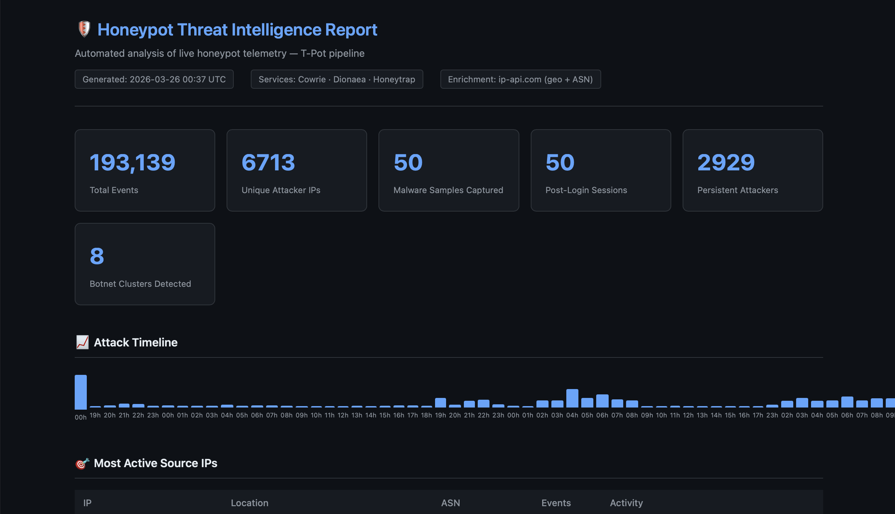

# 🛡️ Honeypot Threat Intelligence Pipeline


A Python CLI pipeline that processes live [T-Pot](https://github.com/telekom-security/tpotce) honeypot telemetry into structured threat intelligence. Raw attack logs from Cowrie (SSH), Dionaea (malware/SMB), and Honeytrap (HTTP) are parsed, enriched with geolocation and ASN data, analyzed across 12 intelligence passes, and rendered into an HTML/JSON threat report.

Deployed on DigitalOcean for 5 days and collected **193,139 attack events** from **6,713 unique IPs**. The pipeline processes, enriches, and analyzes all of it automatically, producing actionable findings rather than raw log dumps.

---

## Sample Report Output



---

## Key Findings

### 🇳🇱 Netherlands-Hosted Infrastructure Dominated Attack Traffic
37.4% of all events (72,239) originated from The Netherlands, driven almost entirely by a single IP, `194.50.16.198` (AS49870), which generated **68,996 events alone** (35.7% of total traffic). This is consistent with VPS provider abuse: attackers renting cheap cloud infrastructure in European data centers to conduct automated scanning campaigns. The Netherlands concentration is not organic; it's rented infrastructure.

### 💰 Targeted Cryptocurrency Credential Hunting
SSH brute-force credential data revealed an active campaign specifically targeting **Solana validator and wallet credentials**. The top pairs were `solana/solana`, `sol/sol`, `sol/123`, `solv/solv`, not generic dictionary attacks. This is a targeted campaign hunting for misconfigured Solana nodes with default or weak credentials, distinct from opportunistic Mirai-style scanning.

### 🪱 Mirai-Variant Botnet Dropper Captured Post-Login
A successful SSH login from `45.205.1.8` executed a 21-command sequence attempting to download and execute `sin.sh` from `196.251.107.133` via every available method: `wget`, `curl`, `busybox wget`, `busybox curl`, and `nc`. This redundant execution pattern is a Mirai-variant signature: the malware tries every binary on the compromised host to ensure delivery regardless of what's installed.

### 🔒 SMB Port 445 Was the Most Targeted Service
SMB accounted for **30,316 events** (15.7% of total), far outpacing SSH at 5,414. This level of SMB scanning is predominantly EternalBlue (MS17-010) and ransomware precursor activity: automated scanners identifying unpatched Windows hosts for lateral movement or ransomware deployment. Dionaea captured **62,201 unique payload hashes** across the collection window.

### 🤖 8 Botnet Credential Clusters Identified
Credential cluster analysis identified 8 groups of IPs sharing identical login dictionaries, a reliable signature that those IPs belong to the same automated campaign. IPs within a cluster aren't independently choosing the same passwords; they're running the same malware with the same hardcoded credential list.

---

## Features

- **3 honeypot parsers** covering Cowrie (SSH/Telnet), Dionaea (malware/SMB), and Honeytrap (HTTP)
- **12 analysis passes** producing findings across IPs, countries, ASNs, ports, credentials, and TTPs
- **Botnet cluster detection** by grouping IPs sharing identical credential dictionaries
- **Post-login session capture:** full command sequences from successful SSH intrusions
- **HTML threat report** with interactive persistent attacker filter and attack timeline chart
- **JSON report** for programmatic consumption or downstream integration
- **Modular architecture:** new parsers added by extending `_PARSERS` in `parser.py`
- **Synthetic sample data** included, clone and run without a live VM

---

## Architecture

```
T-Pot VM (DigitalOcean)
  └── Cowrie    →  cowrie.json     ─┐
  └── Dionaea   →  dionaea.json    ─┼─▶ parser.py ─▶ analyzer.py ─▶ reporter.py
  └── Honeytrap →  honeytrap.json  ─┘        │
                                    T-Pot embedded geo        report.html
                                    (country, ASN, city)      report.json
```

T-Pot pre-enriches every event with geolocation and ASN data at ingest time via its Logstash pipeline, so external enrichment API calls are bypassed entirely. Geo data is extracted directly from the embedded `geoip` block in each event.

```
honeypot-threat-intel/
├── pipeline/
│   ├── main.py         # Click CLI: run and validate commands
│   ├── parser.py       # Log normalization across all three services
│   ├── enricher.py     # ip-api.com geo/ASN enrichment (for non-T-Pot data)
│   ├── analyzer.py     # 12 threat intelligence analysis passes
│   └── reporter.py     # HTML + JSON report generation via Jinja2
├── templates/
│   └── report.html.j2  # Dark-themed report template with interactive filters
├── sample_data/
│   ├── cowrie.json     # Synthetic SSH brute-force logs
│   ├── dionaea.json    # Synthetic malware/SMB logs
│   └── honeytrap.json  # Synthetic HTTP probe logs
├── reports/
│   └── sample_report.html
├── export.py           # Elasticsearch export script (run on the T-Pot VM)
├── requirements.txt
└── README.md
```

Each parser normalizes its service's raw JSON into a unified event schema so the analyzer never has to care which honeypot an event came from. Honeytrap's HTTP payloads are stored as hex; the parser decodes them to extract method, URI, and User-Agent.

---

## Analysis Passes Reference

| Pass | Description |
|---|---|
| Summary | Total events, unique IPs, breakdown by service and event type |
| Top IPs | Most active source IPs with location, ASN, and event breakdown |
| Top Countries | Attack volume by country with percentage distribution |
| Top ASNs | Attack concentration by autonomous system: high concentration indicates VPS/botnet abuse |
| Top Ports | Most targeted destination ports with service labels |
| Top Credentials | Most attempted SSH username/password pairs |
| Repeat Offenders | IPs active across multiple days, filterable by exact day count |
| Credential Clusters | IPs sharing identical credential sets, botnet campaign signature |
| Malware Samples | Unique payload hashes captured by Dionaea |
| Web Recon Paths | Most probed HTTP URIs |
| Attack Timeline | Hourly event volume chart |
| Session Commands | Full post-login command sequences from successful SSH sessions |

---

## Installation

**Requirements:** Python 3.11+

**Step 1: Clone the repository**
```bash
git clone https://github.com/ChrisCortesSanchez/honeypot-threat-intel.git
cd honeypot-threat-intel
```

**Step 2: Create and activate a virtual environment**
```bash
python3 -m venv venv
source venv/bin/activate
```
You should see `(venv)` appear at the start of your terminal prompt confirming the environment is active.

**Step 3: Install dependencies**
```bash
pip install -r requirements.txt
```

---

## Usage

```bash
# Run on synthetic sample data (no VM required)
python -m pipeline.main run --data-dir sample_data --skip-enrichment

# Run on real exported T-Pot data
python -m pipeline.main run --data-dir data --skip-enrichment

# Output JSON only
python -m pipeline.main run --data-dir data --skip-enrichment --format json

# Validate log files before running
python -m pipeline.main validate --data-dir data
```

**Sample terminal output:**
```
[1/4] 📂 Loading logs from data/
      Loaded 193139 events from 3 services

[2/4] ⏭️  Using embedded T-Pot geo enrichment (--skip-enrichment flag set)

[3/4] 🔍 Running analysis passes...

      ┌─ Quick Summary ─────────────────────
      │  Total events   : 193,139
      │  Unique IPs     :  6,713
      │  Post-login sess:    161
      │  Malware samples: 62,201
      │  Botnet clusters:      8
      └─────────────────────────────────────

[4/4] 📄 Writing reports to reports/
      ✅ HTML → reports/report.html
      ✅ JSON → reports/report.json

✨ Pipeline complete.
```

Reports are written to `reports/`. Open the HTML file in any browser.

---

## Deploying T-Pot on DigitalOcean

### 1. Create a Droplet

- **Image:** Ubuntu 22.04 LTS x64
- **Size:** 8 GB RAM / 4 vCPUs minimum (T-Pot runs ~20 Docker containers)
- **Region:** Any, geographically distant from you so traffic is clearly external

> ⚠️ Do **not** add your SSH key during droplet creation. T-Pot moves SSH to port 64295 and manages access itself.

### 2. Configure Firewall

In the DigitalOcean control panel, attach a Cloud Firewall to the droplet:

| Port | Protocol | Source |
|---|---|---|
| 64295 | TCP | Your IP only (management SSH) |
| 1–64294 | TCP | All (honeypot traffic) |
| 1–64294 | UDP | All (honeypot traffic) |

> Docker bypasses UFW by default. Use DigitalOcean's Cloud Firewall: it operates at the network level before traffic reaches the host.

### 3. Install T-Pot

```bash
ssh root@YOUR_DROPLET_IP
apt update && apt install -y git
git clone https://github.com/telekom-security/tpotce
cd tpotce && ./install.sh --type=user
# Choose "hive" for all sensors, system reboots automatically
```

### 4. Export Logs

T-Pot stores all honeypot events in Elasticsearch at `127.0.0.1:64298` using date-based indices (`logstash-YYYY.MM.DD`). All services share these indices and are distinguished by a `type` field (`Cowrie`, `Dionaea`, `Honeytrap`).

`export.py` handles the full export process using the Elasticsearch scroll API to paginate all events regardless of total count, writing each service to its own flat JSON array. Run it on the T-Pot VM:

```bash
# Stop T-Pot and start Elasticsearch standalone
systemctl stop tpot
cd /home/<user>/tpotce/docker/elk/elasticsearch && docker compose up -d

# Check what data is available before exporting
python3 export.py --list

# Export all three services (default)
python3 export.py

# Export specific services only
python3 export.py --services cowrie,dionaea

# Reduce page size if Elasticsearch is struggling
python3 export.py --page-size 2000
```

> **Important:** T-Pot binds two Elasticsearch-related containers. Port 64298 is the real Elasticsearch instance. Port 9200 is ElasticPot, a honeypot that mimics Elasticsearch. `export.py` targets 64298 by default.

Then pull the exported files to your local machine:

```bash
scp -P 64295 <user>@YOUR_IP:/home/<user>/cowrie-backup.json ./data/cowrie.json
scp -P 64295 <user>@YOUR_IP:/home/<user>/dionaea-backup.json ./data/dionaea.json
scp -P 64295 <user>@YOUR_IP:/home/<user>/honeytrap-backup.json ./data/honeytrap.json
```

---

## Collection Stats (Live Run, March 2026)

| Metric | Value |
|---|---|
| Collection window | 5 days |
| Total events | 193,139 |
| Unique attacker IPs | 6,713 |
| Post-login sessions captured | 161 |
| Malware payload hashes (Dionaea) | 62,201 |
| Botnet clusters detected | 8 |
| Top source country | Netherlands (37.4%) |
| Most targeted port | 445/SMB (30,316 events) |

---

## Tech Stack

| Tool | Purpose |
|---|---|
| Python 3.11 | Core language |
| Click | CLI argument parsing |
| Jinja2 | HTML report templating |
| Requests | Elasticsearch scroll API calls and ip-api.com enrichment |
| T-Pot / Cowrie / Dionaea / Honeytrap | Honeypot sensors |
| Elasticsearch | T-Pot log storage and export source |

---

## Roadmap

- [ ] AbuseIPDB enrichment for confidence scoring on top attacker IPs
- [ ] VirusTotal integration for payload hash lookups against known malware
- [ ] Suricata IDS log parser (T-Pot also captures 955,907 Suricata events)
- [ ] Automated IOC export (IPs, hashes, domains) in STIX format

---

## Author

**Christopher Cortes-Sanchez,** NYU Tandon School of Engineering, B.S. Computer Science (May 2026)
Cybersecurity + Mathematics minor | SHPE NYU Tandon
[GitHub](https://github.com/ChrisCortesSanchez) | cc7825@nyu.edu
